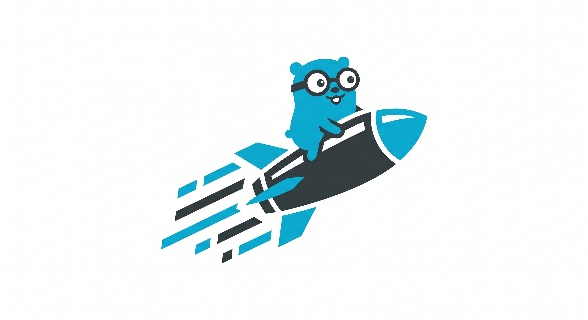

<p align="center">
  
</p>

<h1 align="center">LagariGo</h1>

<p align="center"><em>Speed, simplicity, trust. A modern Go starter kit.</em></p>

---

A type-safe, server-rendered web starter built on Go. Clone it, swap the theme, ship it.

## Stack

- **Fiber** &mdash; HTTP framework
- **Templ** &mdash; type-safe HTML templates (compile-time checked)
- **HTMX** &mdash; server-driven reactivity, no SPA bundle
- **GORM** &mdash; SQLite or MySQL
- **Plain CSS** &mdash; bring your own theme, no Tailwind

## Quick start

```bash
# 1. Templ CLI (one time)
make install-tools

# 2. Dependencies
go mod tidy

# 3. Configuration
cp .env.example .env

# 4. Run
make dev
```

App runs at `http://localhost:3000`.

On first boot the app will:
- Create the database (SQLite file or MySQL schema)
- Seed an admin user using `ADMIN_EMAIL` / `ADMIN_PASSWORD` from `.env`
- Add a sample page (`/welcome`) and default header/footer menu links

## Project layout

```
cmd/server/         # main.go (entry point)
internal/
  auth/             # session helpers
  config/           # .env loader
  database/         # GORM models, connection, seeder
  handler/          # HTTP handlers
  middleware/       # auth & admin guards
public/assets/      # static files (CSS / JS / images)
views/
  layouts/          # base layout
  components/       # header, footer
  pages/            # home, about, contact, login, register, dynamic, 404
  pages/admin/      # admin panel views
.env.example
Makefile            # make dev | build | gen
```

## Routes

- `/` &mdash; Home
- `/about-us` &mdash; About
- `/contact` &mdash; Contact
- `/login`, `/register`, `/logout`
- `/admin` &mdash; Dashboard (admin only)
- `/:slug` &mdash; Dynamic pages (unlimited, managed from the admin panel)

> Reserved slugs (`about-us`, `contact`, `login`, `register`, `admin`, `assets`) cannot be used for dynamic pages.

## Database

Set `DB_DRIVER=sqlite` (default) or `DB_DRIVER=mysql` in `.env`. For MySQL, fill in `DB_HOST`, `DB_USER`, `DB_PASSWORD`, `DB_NAME`.

## Security

- **XSS** &mdash; Templ auto-escapes all interpolated values. `templ.SafeURL` is used only for trusted URLs.
- **CSRF** &mdash; All state-changing forms include a `_csrf` token, validated by Fiber's CSRF middleware.
- **Passwords** &mdash; Hashed with bcrypt.
- **Sessions** &mdash; HttpOnly, SameSite=Lax cookies.

## Theming

Replace `public/assets/css/style.css` with your own. Class names are semantic (`.btn`, `.card`, `.flash`, etc.) and easy to map to any design system. The default theme uses the Go cyan palette with light/dark variants.

## Commands

```bash
make dev        # templ generate + go run
make build      # templ generate + go build -> bin/lagarigo
make gen        # only templ generate
make tidy       # go mod tidy
make clean      # remove bin/, *.db, *_templ.go
```

## Development

After editing any `.templ` file, regenerate with `make gen` (or run `templ generate --watch` for live regeneration during development).

## License

MIT
